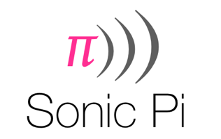

## Sonic Pi Scheme of Work

###Introduction

[Sonic Pi](http://www.cl.cam.ac.uk/projects/raspberrypi/sonicpi/) is an open source programming environment developed by Dr Sam Aaron, designed to explore and teach programming concepts through the process of creating new sounds. This is a scheme of work which emphasises the importance of creativity in the learning process and gives users the control to turn their sonic ideas into reality.

This scheme of work is specifically targetted towards introductory KS3 Computer Science. This has been developed in harmony with the new Computing curriculum in the UK. This scheme of work is the result of a close collaboration between Computing & ICT teachers and researchers at the University of Cambridge. It has been successfully trialled at a number of schools.

###Students will learn:

Over the course of six lessons, students will learn:

- What a Raspberry Pi is, what are it's main features, and how to setup and use one.
- How to write text based code to produce a music track.
- Computer Science concepts:
	- Sequencing
	- Debugging
	- Iteration
	- Conditionals
	- Data Structures
	- Algorithms
	- Functions
	- Concurrency

# Getting Set Up!

##Step 1: Do you have a GitHub account?

Make sure that you have signed up for [GitHub here](https://github.com/). You should use you school email account and your username should match. eg (email: jsmith1234@sohamcollege.org.uk username: jsmith1234)
##Step 2: Make a copy of this *repository*

A repository is a type of folder on github. Making a copy of a respoistory is called **forking**. Click on the 'Fork' button at the top of the screen on the right hand side, and a copy of everything in this respoitory called **sonic-pi-lessons** will appear in your account.

Now the resources for this unit have been forked to your github account page, you can find them here.

Now work through the activities in 

###[Lesson 1 : Sequencing>>](Lesson-1)
